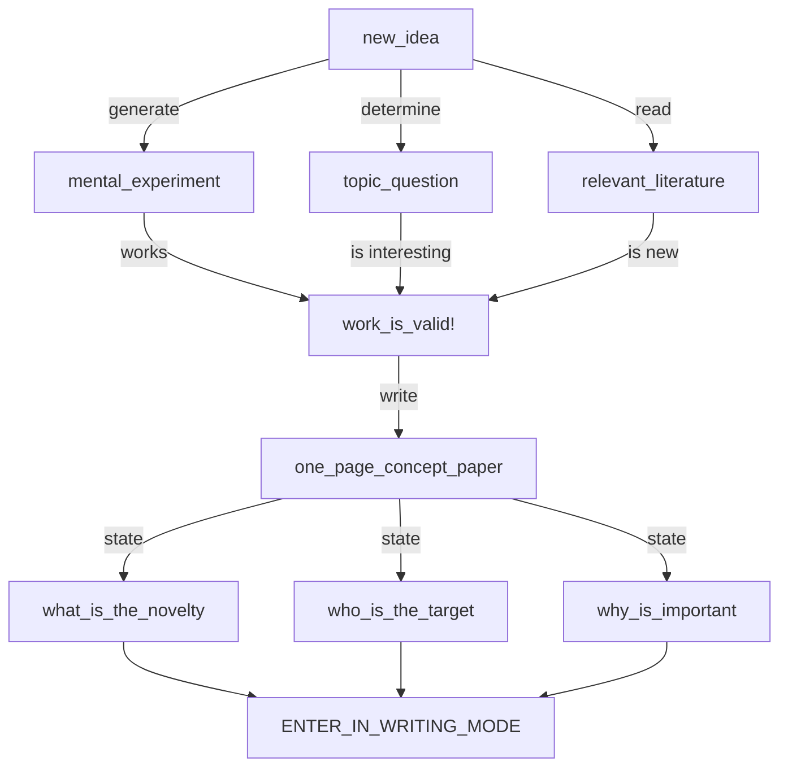

# Academic english

## To keep in mind

1) Focus on the **point** of your research 
2) Use a **minimum** of essential technical terms
3) Introduce you strategy with **if** sentences 
4) State the research question in terms of **relationships** between **observable variables**

## Cicle of producing a scientific paper

### Pre-writing stage 
- Attach a time schedule to your writing plan
- Start writing immediately
- Establish good working habits
- Arrange regular meetings

> **_INCOMPLETE_**